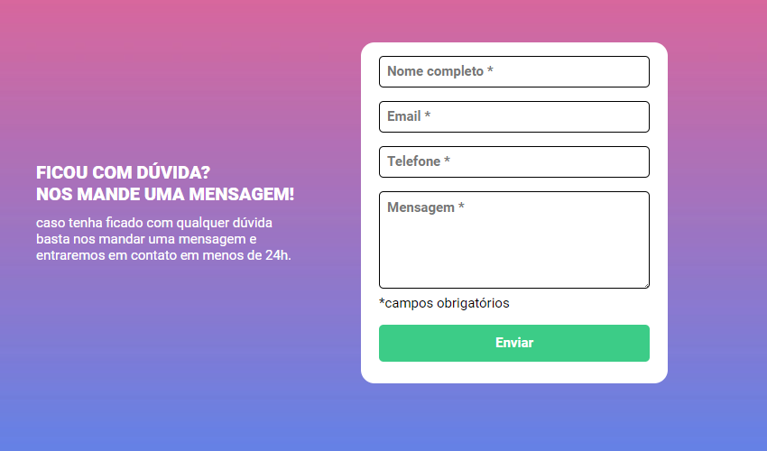
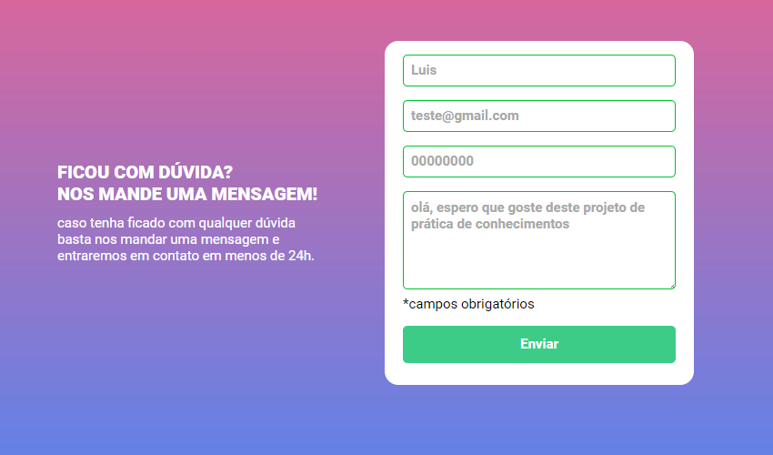
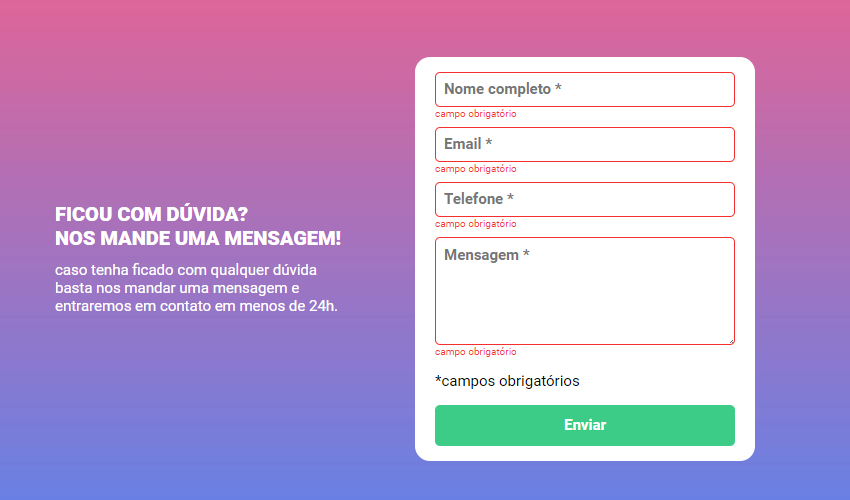
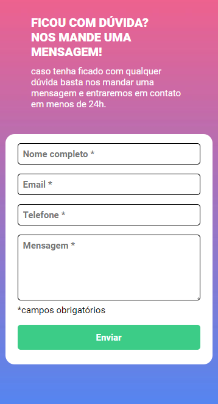

# Formulário com verificação de preenchimento de dados

## Índice

- [Visão geral](#visão-geral)
  - [Desafio](#o-desafio)
  - [Screenshot](#screenshot)
  - [Links](#links)
- [Meu processo](#meu-processo)
  - [Feito com](#feito-com)
  - [O que eu aprendi](#o-que-eu-aprendi)
  - [Desenvolvimento contínuo](#desenvolvimento-contínuo)  
- [Autor](#autor)

## Visão geral

### O desafio

Os usuários devem ser capazes de:

- Veja o layout ideal para a página, dependendo do tamanho da tela do dispositivo.
- Criar um formulário com os seguintes condições:
    - Caso preenchido deve ficar em verde as bordas do inputs
    - Caso esteja vazio deve ficar com as bordas em vermelho e apresentar um texto ***Campo obigatório*** em vermelho

### Screenshot

### Links

- Live Site URL: [https://luis-eduardo-drehmer.github.io/formulario-com-validacao-js/]
## Meu processo

### Construção

- HTML5 semântico
- CSS desktop
- CSS Mobile
- JavaScript

### O que eu aprendi

1. HTML:
    - Aprofundei meu conhecimento nas tags HTML voltadas a elementos de formulário; 
2. JavaScript:
    - Aprendi a verificar, adicionar e remover classes dos elementos HTML;
    - Adicionar eventos aos elementos;
    - O uso do **forEach()** em uma lista;

### Desenvolvimento contínuo

Para os próximos projetos quero focar em melhorar e aprofundar meu conhecimento em JavaScrits

## Autor

- Linkedin - [Luis Eduardo Drehmer](https://www.linkedin.com/in/luis-eduardo-drehmer-818303228/)
- Frontend Mentor - [@Luis-Eduardo-Drehmer](https://www.frontendmentor.io/profile/Luis-Eduardo-Drehmer)
- Instagram - [@luisdrehmer](https://www.instagram.com/luisdrehmer/)

